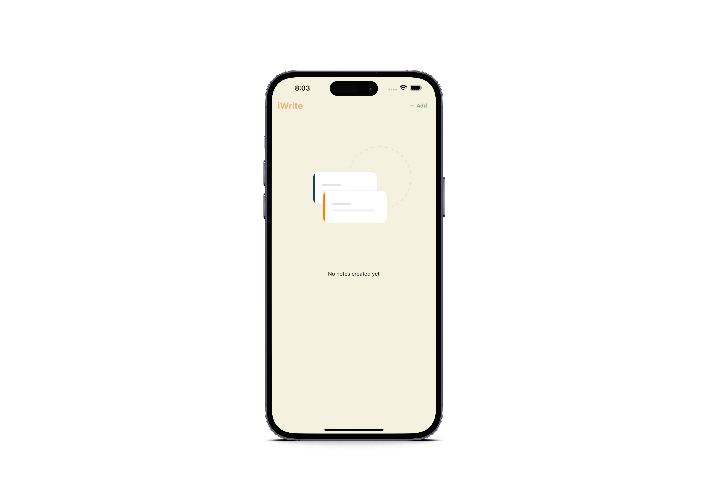
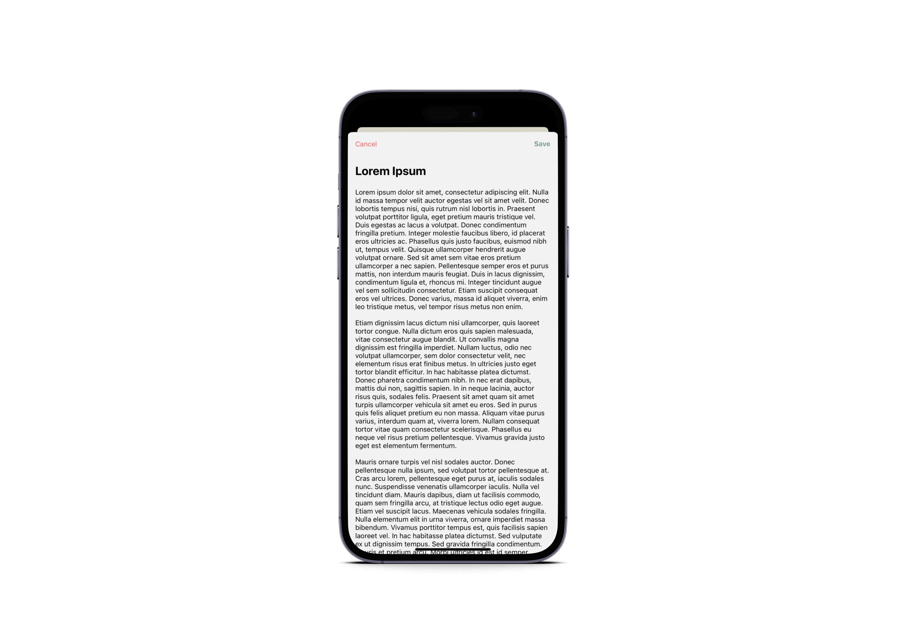
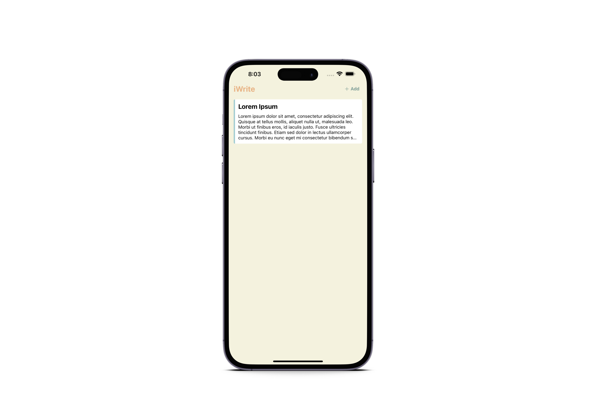
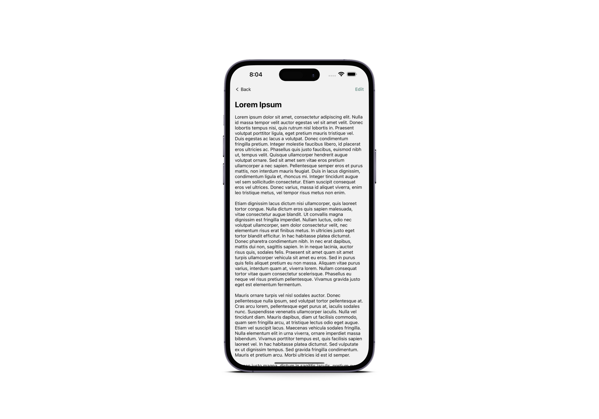

#  iWrite

iWrite es una aplicación básica de notas locales creada con el fin de hacer pruebas. Esta aplicación te permite crear notas que se almacenan de forma local en tus dispositivos.

## Color Reference

| Color             | Hex                                                                |
| ----------------- | ------------------------------------------------------------------ |
| Primary |  #F4F2DE |
| Secondary |  #7C9D96 |
| Tertiary |  #A1CCD1 |
| Accent |  #E9B384 |

## Capturas

## Authors

- [@gartnerleandro](https://www.github.com/gartnerleandro)

